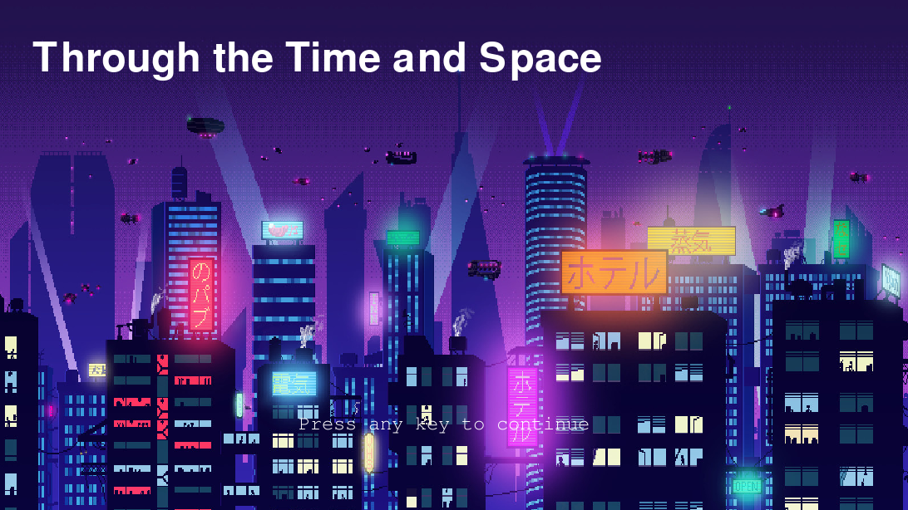
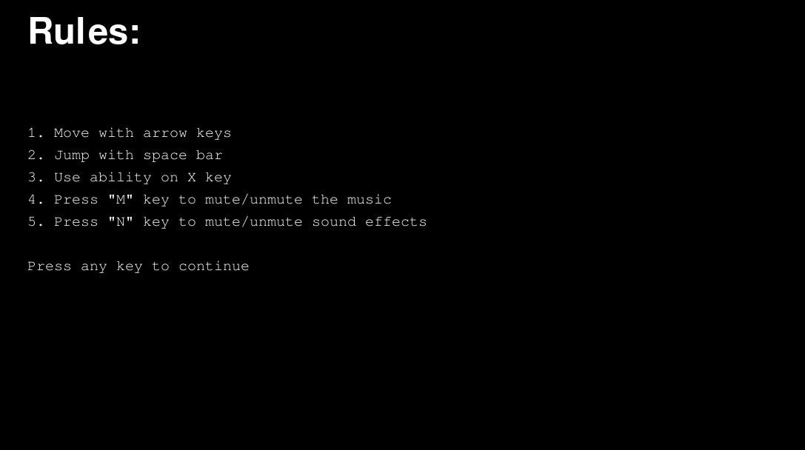
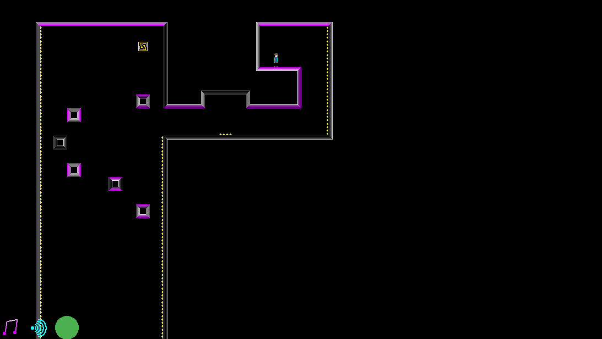

# Through the Time and Space
is a platformer-style game. Goal of every level is to reach
end portal avoiding various obstacles.


Player controls:
- You can move left or right using arrow keys
- Jump by pressing SPACE
- Use ability by pressing 'X' button on keyboard


Abilities:
- Regular human and Jonathan don`t have a special ability,
but Jonathan can take up to 3 hits instead of regular 1
- Joseph can increase his speed for short amount of time
- Diavolo can gain invincibility for short amount of time
  (matches the length of sound effect playing)
- Pucci can reverse his gravity


You can mute and unmute in-game music and sounds by pressing
'M' and 'N' keys on keyboard


# INSTALLATION:
```
git clone git@github.com:IgorRazinAlex/study_python_project1.git ~/Games/ThroughTheTimeAndSpace
cd ~/Games/ThroughTheTimeAndSpace
chmod +x install.sh
./install.sh
```

# RUN:
```
./run.sh
```

# INSTALLATION and RUN in Docker:
```
chmod +x install_docker.sh
./install_docker.sh
./run_docker.sh
```